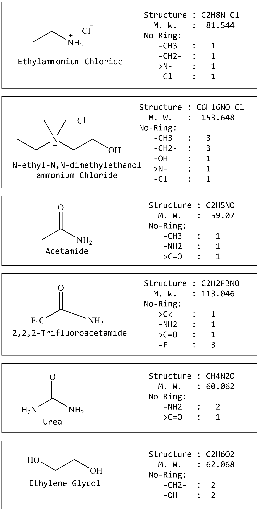

# More Examples

Please cite our paper;

```
Zhong, X.; Velez, C.; Acevedo, O. "Partial Charges Optimized by Genetic Algorithms for Deep Eutectic Solvent Simulations." 2021 (under review).
```

This folder contains our paper's setting files for DES elevated Surface Tension calculation

To use them;

Please install our package first, which can be download at https://github.com/orlandoacevedo/mLJR

Then command `mljr` will be ready to use.


# Setup

For example, we have some molecules;




## First, generate template setting file

```
mljr -t             # (purity)

OR

mljr -t --CCG       # (binary mixture)
```

In scripts, two types of templates are provided.


## Second, make setting file

With the understanding of above image, selectively make combinations & groups of your molecule.

To see available groups (structure segments), please use command;

```
mljr -g
```

## Last, run

```
mljr -f YOUR-SETTING-FILE       # show results on screen

OR 

mljr -f YOUR-SETTING-FILE -o    # append results to your file
```


# Testing on this folder

Also, here provides some samples, to test them;

```
mljr -f ONE-OF-SETTING-FILES-INSIDE-THIS-FOLDER
```


